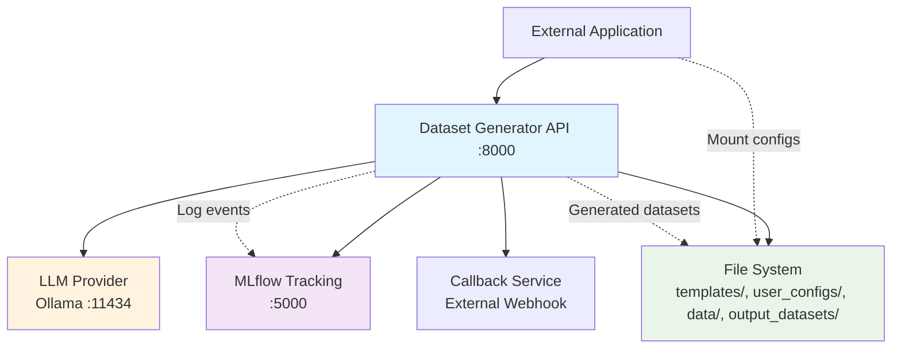
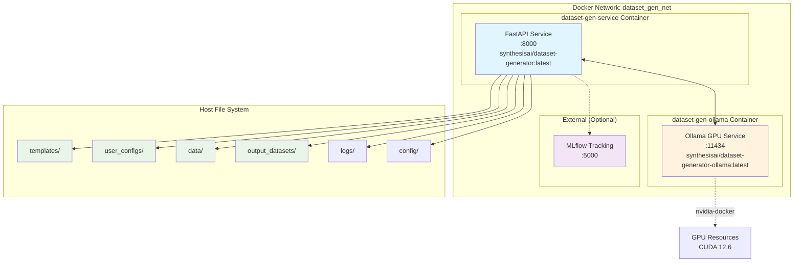
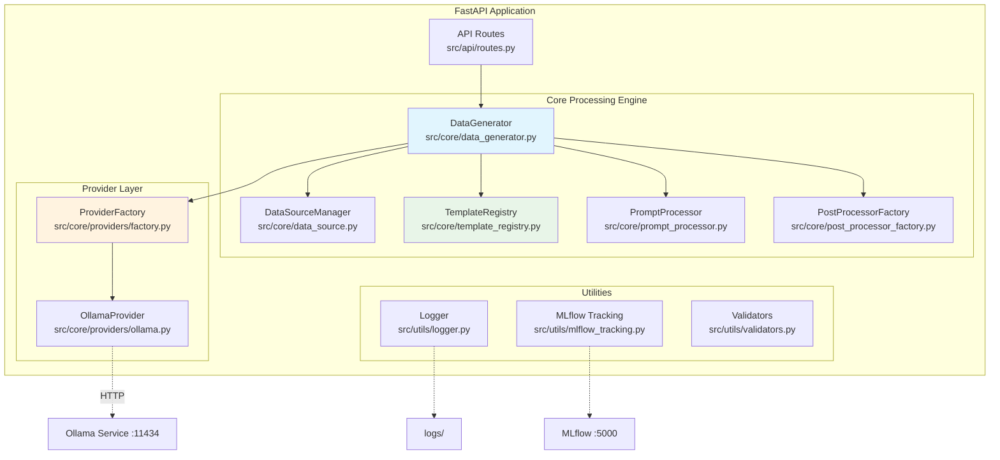
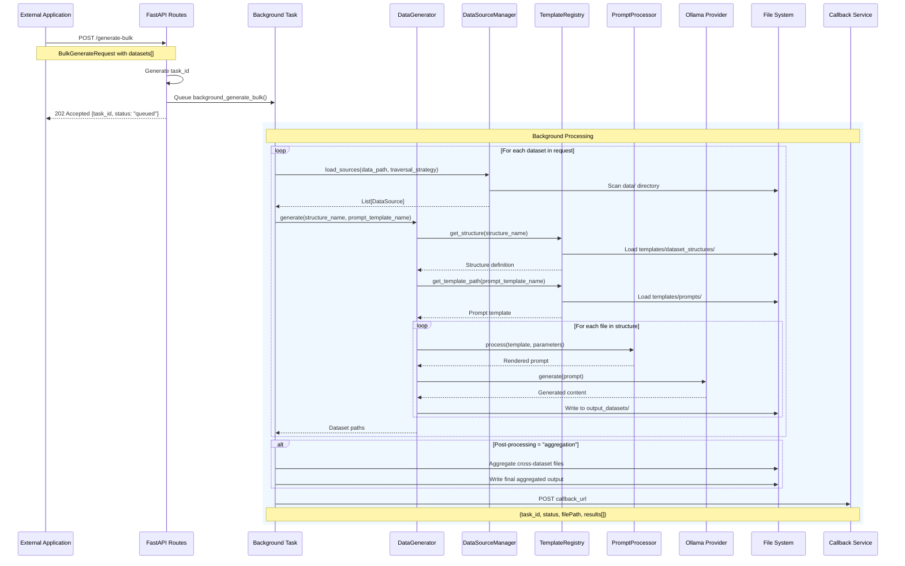
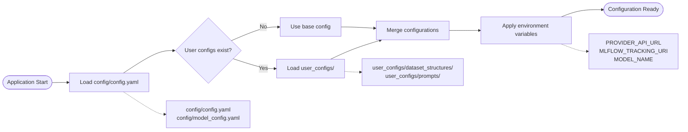

# Architecture

## 1. Overview

### System Goals

The Dataset Generator is a **containerized, generic synthetic dataset generation service** designed for embedding into external projects. It provides:

- **Generic LLM Integration**: Works with any LLM provider (Ollama, OpenAI, etc.) via configurable providers
- **Template-Driven Generation**: Customizable prompts and output structures via [`templates/`](../templates/) and [`user_configs/`](../user_configs/)
- **Multi-Tenant Support**: Different configurations per agency/project through mounted configurations
- **Scalable Processing**: Background task processing with bulk dataset generation
- **RESTful API**: Generate datasets programmatically with status tracking

### Non-Goals

- **Real-time streaming generation**: Designed for batch processing, not real-time streaming
- **Built-in LLM hosting**: Delegates to external LLM services (Ollama, OpenAI, etc.)
- **Data storage**: Outputs to mounted volumes, doesn't provide persistent storage
- **User authentication**: Designed to be embedded behind authentication layers
- **Model fine-tuning**: Uses pre-trained models, doesn't provide training capabilities

## 2. System Context (C4 L1)



**Key External Dependencies:**
- **LLM Provider** (via `PROVIDER_API_URL`): Gemma 3 12B via Ollama GPU service  
- **MLflow** (via `MLFLOW_TRACKING_URI`): Optional experiment tracking
- **File System**: Mounted volumes for templates, configs, and outputs
- **Callback Services**: Optional webhook notifications for bulk processing completion

## 3. Containers (C4 L2)

Based on [`docker-compose.yml`](../docker-compose.yml):



### Container Details

**dataset-gen-service** ([`Dockerfile.service`](../Dockerfile.service)):
- **Base**: `python:3.10-slim`
- **Ports**: `8000:8000`
- **Environment**: `PROVIDER_API_URL`, `MLFLOW_TRACKING_URI`, `MODEL_NAME`
- **Volumes**: All application directories mounted from host

**dataset-gen-ollama** ([`Dockerfile.ollama-gpu`](../Dockerfile.ollama-gpu)):
- **Base**: `nvidia/cuda:12.6.3-runtime-ubuntu22.04`
- **Ports**: `11434:11434`
- **GPU**: CUDA-enabled with nvidia-docker runtime
- **Models**: Persistent volume for Ollama models

## 4. Components (C4 L3)

Based on [`src/`](../src/) structure:



### Key Components

**Traversal Strategies** ([`src/core/data_source.py`](../src/core/data_source.py)):
- **`flat`**: Single directory scanning
- **`recursive`**: Deep directory traversal
- **`institutional`**: Structured agency/topic hierarchies  
- **`pattern`**: Glob pattern matching (e.g., `**/cleaned.txt`)

**Prompting System** ([`src/core/prompt_processor.py`](../src/core/prompt_processor.py)):
- Template variable substitution from [`templates/prompts/`](../templates/prompts/)
- Language-aware prompt generation (Estonian/English)
- Dynamic parameter injection from [`user_configs/`](../user_configs/)

**Dataset Structuring** ([`src/core/template_registry.py`](../src/core/template_registry.py)):
- YAML-defined output structures from [`templates/dataset_structures/`](../templates/dataset_structures/)
- Hierarchical file generation (e.g., `faqs.json`, `examples/sample1.json`)
- Format-agnostic output (JSON, CSV, text)

**Tracking & Logging**:
- Structured logging to [`logs/`](../logs/) directory
- MLflow experiment tracking for generation metrics
- Background task status management

## 5. Data Flow

### POST /generate-bulk Sequence



### Configuration Loading Flow



## 6. Configuration And Extensibility

### Template System Extensibility

**Prompt Templates** ([`templates/prompts/`](../templates/prompts/)):
```
templates/prompts/
├── default/
│   ├── base_prompt.txt
│   ├── json_generator.txt
│   └── text_generator.txt
└── examples/
    ├── conversations/
    └── qa_pairs/
```

**Dataset Structures** ([`templates/dataset_structures/`](../templates/dataset_structures/)):
```yaml
# Example: templates/dataset_structures/single_question.yaml
root:
  files:
    faqs: 
      format: json
  subdirectories:
    examples:
      files:
        sample1: {}
```

### Provider Environment Variables

Key environment variables for provider integration:

```bash
# LLM Provider Configuration  
PROVIDER_NAME=ollama                    # Provider type (ollama, openai, etc.)
PROVIDER_API_URL=http://ollama:11434    # LLM service endpoint
MODEL_NAME=gemma3:1b-it-qat            # Model identifier

# MLflow Integration
MLFLOW_TRACKING_URI=http://mlflow:5000  # Experiment tracking

# Service Configuration
SERVICE_DEBUG=false                     # Debug logging level
SERVICE_HOST=0.0.0.0                   # Bind address
SERVICE_PORT=8000                       # API port
```

### User Configuration Override

Mount custom configurations to override defaults:

```yaml
# docker-compose.yml excerpt
volumes:
  - ./your-templates:/app/templates              # Custom prompt templates
  - ./your-configs:/app/user_configs             # User-specific structures
  - ./your-data:/app/data                        # Input data sources
  - ./generated-datasets:/app/output_datasets    # Output location
```

**Configuration Precedence** (highest to lowest):
1. Environment variables (`PROVIDER_API_URL`, etc.)
2. User configs (`user_configs/`)
3. Base templates (`templates/`)
4. Default config (`config/config.yaml`)

## 7. Deployment and Environments

### Docker-First Architecture

**Development:**
```bash
# From repository root
docker compose up -d
curl http://localhost:8000/health
```

**Production Integration:**
```yaml
services:
  dataset-generator:
    image: synthesisai/dataset-generator:latest
    environment:
      - PROVIDER_API_URL=${LLM_ENDPOINT}
      - MLFLOW_TRACKING_URI=${MLFLOW_URL}
    volumes:
      - ./production-templates:/app/templates
      - ./agency-configs:/app/user_configs
      - ./datasets-output:/app/output_datasets
```

### Scaling Considerations

- **Horizontal Scaling**: Multiple service instances with shared file system
- **GPU Resources**: Ollama container requires NVIDIA GPU access
- **Background Tasks**: In-memory task store (consider Redis for multi-instance)
- **File I/O**: Shared storage recommended for multi-container deployments

## 8. Observability

### Logging Architecture

**Structured Logging** ([`src/utils/logger.py`](../src/utils/logger.py)):
- Application logs: [`logs/synthetic_data_service.log`](../logs/)
- Request/response logging for API endpoints
- Background task progress tracking
- Error tracking with stack traces

**Log Aggregation:**
```bash
# Log locations (mounted volumes)
./logs/                              # Application logs
./output_datasets/*/metadata.json   # Generation metadata per dataset
```

### MLflow Integration

**Experiment Tracking** ([`src/utils/mlflow_tracking.py`](../src/utils/mlflow_tracking.py)):
- Dataset generation metrics
- Model performance tracking  
- Parameter logging (temperature, num_samples, etc.)
- Artifact logging (generated datasets, configurations)

**MLflow Configuration:**
```yaml
# config/config.yaml
mlflow:
  experiment_name: "synthetic_data_generation"
```

**Environment Integration:**
```bash
MLFLOW_TRACKING_URI=http://mlflow:5000
```

### Health Monitoring

**Health Check Endpoint:**
```bash
GET /health
# Response: {"status": "healthy", "version": "1.0.0", "provider": "ollama"}
```

**Task Status Monitoring:**
```bash
GET /task-status/{task_id}
GET /tasks  # List all tasks
DELETE /task/{task_id}  # Cleanup completed tasks
```

## 9. Security

### Input Validation

**Path Traversal Protection** ([`src/api/routes.py`](../src/api/routes.py)):
- Data path validation (no `..` sequences)
- Output filename sanitization
- File extension validation

**Request Validation:**
- Pydantic models for request/response schemas
- Field-level validation with regex patterns
- Input sanitization for prompt injection protection

### Container Security

**Non-Root Execution:** Service containers run with restricted permissions
**Network Isolation:** Docker network separation (`dataset_gen_net`)
**Volume Mounts:** Read-only mounts where appropriate

### Environment Variables

Sensitive configuration via environment variables:
- API endpoints (`PROVIDER_API_URL`)
- Authentication tokens (if required by LLM provider)
- Callback URLs (`callback.url` in config)

## 10. ADR Index

**Architecture Decision Records:**

1. **[001-containerization-strategy.md]** - Docker-first architecture with GPU support
   - *Files*: [`docker-compose.yml`](../docker-compose.yml), [`Dockerfile.ollama-gpu`](../Dockerfile.ollama-gpu)

2. **[002-api-design-patterns.md]** - RESTful API with background task processing  
   - *Files*: [`src/api/routes.py`](../src/api/routes.py)

3. **[003-configuration-management.md]** - YAML-based configuration with user overrides
   - *Files*: [`config/config.yaml`](../config/config.yaml), [`user_configs/`](../user_configs/)

4. **[004-bulk-processing-architecture.md]** - Background task processing with callbacks
   - *Files*: [`src/api/routes.py`](../src/api/routes.py) (`background_generate_bulk`)

5. **[005-provider-abstraction.md]** - Plugin architecture for LLM providers
   - *Files*: [`src/core/providers/factory.py`](../src/core/providers/factory.py), [`src/core/providers/ollama.py`](../src/core/providers/ollama.py)

6. **[006-template-system-design.md]** - Extensible template and structure system
   - *Files*: [`templates/`](../templates/), [`src/core/template_registry.py`](../src/core/template_registry.py)

7. **[007-data-traversal-strategies.md]** - Multiple data source loading patterns
   - *Files*: [`src/core/data_source.py`](../src/core/data_source.py)
