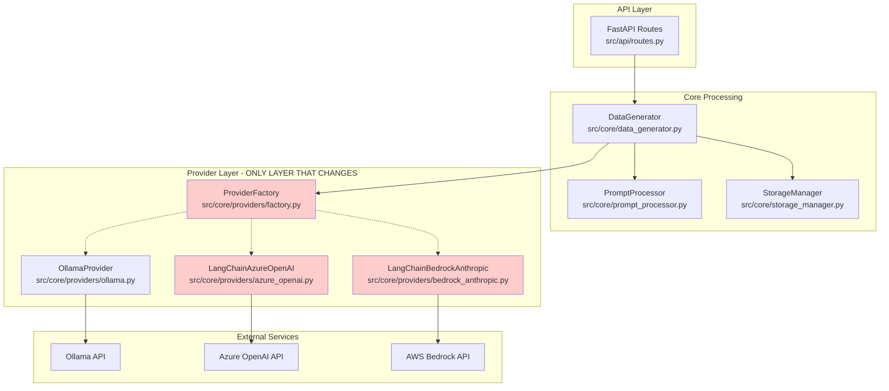
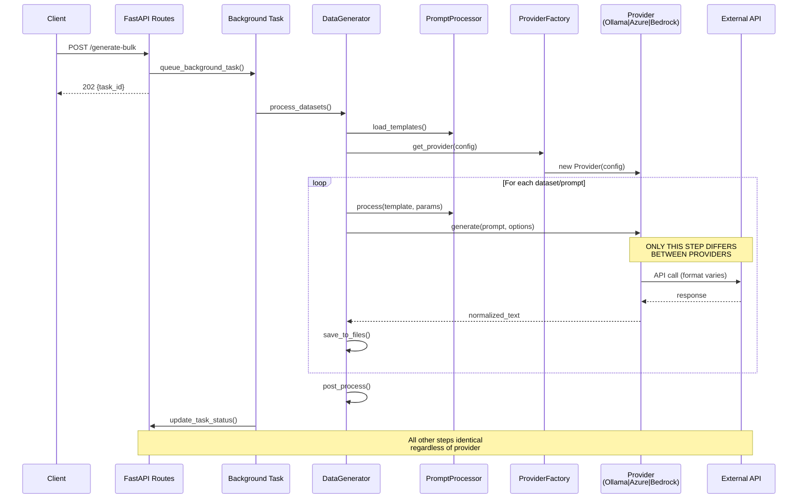

# Proprietary LLM Architecture Plan

## 1. Problem & Goals

### Problem Statement
The Estonian Government AI Dataset Generator currently supports only Ollama as an LLM provider. Government agencies require access to enterprise-grade proprietary LLM APIs for improved performance, compliance, and reliability while maintaining the existing dataset generation workflows and API contracts.

### Goals
- **Add Azure OpenAI and AWS Bedrock (Anthropic Claude) providers** via LangChain orchestration
- **Zero impact on existing flows**: Data traversal, templates/structures, background jobs, callbacks, MLflow, file I/O, API request/response schemas remain identical
- **Full backward compatibility**: Default provider remains "ollama"; existing configurations continue working
- **Enterprise-grade reliability**: Rate limiting, retries, cost tracking, and observability
- **Seamless integration**: Same API schemas and output structures across all providers

### Non-Goals
- **Fine-tuning or model training**: Only inference through existing models
- **Streaming UI interfaces**: Batch processing focus maintained
- **Direct API calls**: All proprietary APIs accessed through Azure OpenAI or AWS Bedrock services
- **Modifying non-generation flows**: Template system, data structures, task management unchanged

## 2. Scope & Requirements

### 2.1 Functional Requirements

| Requirement | Description | Acceptance Criteria |
|-------------|-------------|-------------------|
| **FR-01** | Provider Selection | Support `PROVIDER_NAME="azure-openai"` and `PROVIDER_NAME="bedrock-anthropic"` via environment or per-request override |
| **FR-02** | API Schema Parity | All providers produce identical API request/response schemas to current Ollama implementation |
| **FR-03** | Output Structure Parity | Generated datasets maintain identical file structures, formats, and metadata regardless of provider |
| **FR-04** | Batch Processing Safety | Background jobs (`/generate-bulk`) work identically across all providers without modification |
| **FR-05** | Configuration Inheritance | Provider-specific settings follow same pattern as Ollama (env vars → config → per-request override) |
| **FR-06** | Parameter Normalization | Common parameters (temperature, max_tokens) mapped appropriately to each provider's API |

### 2.2 Non-Functional Requirements

| Requirement | Description | Target |
|-------------|-------------|---------|
| **NFR-01** | Rate Limiting | Support provider-specific QPS and token-per-minute limits with in-process enforcement |
| **NFR-02** | Retry Strategy | Jittered exponential backoff for retryable failures (throttling, 5xx errors) |
| **NFR-03** | Observability | Structured logging and MLflow tracking for provider, model, latency, tokens, cost |
| **NFR-04** | Security | Secure credential handling; no secrets logged or included in outputs |
| **NFR-05** | Testability | Unit, integration, contract, and load tests for each provider |
| **NFR-06** | Cost Tracking | Token usage and cost estimation logging where available |

## 3. Target Architecture (Delta-Only)

### 3.1 Provider Layer Extension

**Current Architecture Preserved**: All components outside the provider layer remain unchanged.

**Files Modified**:
- [`src/core/providers/factory.py`](../../src/core/providers/factory.py) - Add new provider registrations
- **New Files**:
  - `src/core/providers/azure_openai.py` - LangChain Azure OpenAI provider
  - `src/core/providers/bedrock_anthropic.py` - LangChain Bedrock Anthropic provider

**Files Unchanged**:
- [`src/core/data_generator.py`](../../src/core/data_generator.py) - Generation orchestration
- [`src/core/prompt_processor.py`](../../src/core/prompt_processor.py) - Template processing
- [`src/api/routes.py`](../../src/api/routes.py) - API endpoints and background jobs
- All template, structure, and post-processing components

### 3.2 Provider Interface Compliance

```python
# src/core/providers/base.py - UNCHANGED
class ModelProvider(ABC):
    @abstractmethod
    def generate(self, prompt: str, options: Optional[Dict[str, Any]] = None) -> str:
        """Generate text from a prompt"""
        pass

    @abstractmethod 
    def health_check(self) -> bool:
        """Check if the model provider is available"""
        pass
```

### 3.3 New Provider Implementations

```python
# src/core/providers/azure_openai.py - NEW
class LangChainAzureOpenAIProvider(ModelProvider):
    def __init__(self, config: Dict[str, Any] = None):
        # Initialize LangChain Azure OpenAI with config
        pass
    
    def generate(self, prompt: str, options: Optional[Dict[str, Any]] = None) -> str:
        # LangChain → Azure OpenAI API call with parameter normalization
        pass
        
    def health_check(self) -> bool:
        # Test Azure OpenAI endpoint connectivity
        pass

# src/core/providers/bedrock_anthropic.py - NEW  
class LangChainBedrockAnthropicProvider(ModelProvider):
    def __init__(self, config: Dict[str, Any] = None):
        # Initialize LangChain Bedrock with Claude models
        pass
        
    def generate(self, prompt: str, options: Optional[Dict[str, Any]] = None) -> str:
        # LangChain → AWS Bedrock → Anthropic Claude API call
        pass
        
    def health_check(self) -> bool:
        # Test Bedrock service connectivity
        pass
```

### 3.4 Factory Registration

```python
# src/core/providers/factory.py - MODIFIED
def get_provider(config: Dict[str, Any] = None) -> ModelProvider:
    providers = {
        "ollama": lambda cfg: OllamaProvider(cfg),
        "azure-openai": lambda cfg: LangChainAzureOpenAIProvider(cfg),     # NEW
        "bedrock-anthropic": lambda cfg: LangChainBedrockAnthropicProvider(cfg)  # NEW
    }
    # ... rest unchanged
```

## 4. Component & Sequence Diagrams

### 4.1 L3 Component Diagram



### 4.2 POST /generate-bulk Sequence Diagram



## 5. Configuration & Environment Variables

### 5.1 Shared Configuration

| Variable | Description | Default | Example |
|----------|-------------|---------|---------|
| `PROVIDER_NAME` | Provider selection | `"ollama"` | `"azure-openai"`, `"bedrock-anthropic"` |
| `MODEL_NAME` | Model/deployment identifier | `"gemma3:1b-it-qat"` | `"gpt-4o"`, `"claude-3-5-sonnet"` |
| `PROVIDER_TIMEOUT_SECONDS` | Request timeout | `60` | `30` |
| `PROVIDER_MAX_QPS` | Rate limit (queries/second) | `10` | `5` |
| `PROVIDER_MAX_TOKENS_PER_MINUTE` | Token rate limit | `100000` | `50000` |

### 5.2 Azure OpenAI Configuration (via LangChain)

| Variable | Description | Required | Example |
|----------|-------------|----------|---------|
| `AZURE_OPENAI_ENDPOINT` | Azure endpoint URL | Yes | `https://my-resource.openai.azure.com/` |
| `AZURE_OPENAI_API_KEY` | Azure API key | Yes | `abc123...` |
| `AZURE_OPENAI_API_VERSION` | API version | No | `2024-02-15-preview` |
| `AZURE_OPENAI_DEPLOYMENT` | Deployment name | No | `gpt-4o-deployment` |

**Model Name Mapping**:
```yaml
# If MODEL_NAME provided without deployment, map to Azure deployment names
model_mappings:
  "gpt-4o": "gpt-4o-deployment"
  "gpt-4o-mini": "gpt-4o-mini-deployment"
  "gpt-35-turbo": "gpt-35-turbo-deployment"
```

### 5.3 AWS Bedrock Configuration (via LangChain)

| Variable | Description | Required | Example |
|----------|-------------|----------|---------|
| `AWS_REGION` | AWS region | Yes | `us-east-1` |
| `AWS_PROFILE` | AWS profile name | No | `default` |
| `AWS_BEDROCK_ACCESS_KEY_ID` | AWS access key | No* | `AKIA...` |
| `AWS_BEDROCK_SECRET_ACCESS_KEY` | AWS secret key | No* | `abc123...` |
| `BEDROCK_MODEL_ID` | Bedrock model identifier | No | `anthropic.claude-3-5-sonnet-20240620-v1:0` |

\* *Required if not using IAM roles or AWS profiles*

**Model Name Mapping**:
```yaml
# If MODEL_NAME provided, map to Bedrock model IDs
model_mappings:
  "claude-3-5-sonnet": "anthropic.claude-3-5-sonnet-20240620-v1:0"
  "claude-3-haiku": "anthropic.claude-3-haiku-20240307-v1:0"
  "claude-3-opus": "anthropic.claude-3-opus-20240229-v1:0"
```

### 5.4 Docker Compose Examples

**Azure OpenAI Configuration**:
```yaml
# docker-compose.override.yml
version: '3'
services:
  synthetic-data-service:
    environment:
      - PROVIDER_NAME=azure-openai
      - MODEL_NAME=gpt-4o
      - AZURE_OPENAI_ENDPOINT=https://my-resource.openai.azure.com/
      - AZURE_OPENAI_API_KEY=${AZURE_OPENAI_API_KEY}
      - AZURE_OPENAI_API_VERSION=2024-02-15-preview
      - AZURE_OPENAI_DEPLOYMENT=gpt-4o-deployment
      - PROVIDER_MAX_QPS=5
      - PROVIDER_MAX_TOKENS_PER_MINUTE=50000
```

**AWS Bedrock Configuration**:
```yaml
# docker-compose.override.yml  
version: '3'
services:
  synthetic-data-service:
    environment:
      - PROVIDER_NAME=bedrock-anthropic
      - MODEL_NAME=claude-3-5-sonnet
      - AWS_REGION=us-east-1
      - AWS_PROFILE=default
      - PROVIDER_MAX_QPS=3
      - PROVIDER_MAX_TOKENS_PER_MINUTE=30000
    volumes:
      - ~/.aws:/root/.aws:ro  # AWS credentials
```

### 5.5 Per-Request Override Examples

**Azure OpenAI Override**:
```json
{
  "datasets": [...],
  "provider_override": {
    "provider_name": "azure-openai",
    "model_name": "gpt-4o-mini",
    "azure_deployment": "gpt-4o-mini-deployment",
    "parameters": {
      "temperature": 0.5,
      "max_tokens": 2048
    }
  }
}
```

**Bedrock Override**:
```json
{
  "datasets": [...],
  "provider_override": {
    "provider_name": "bedrock-anthropic", 
    "model_name": "claude-3-haiku",
    "bedrock_model_id": "anthropic.claude-3-haiku-20240307-v1:0",
    "parameters": {
      "temperature": 0.7,
      "max_tokens": 4096
    }
  }
}
```

## 6. Parameter Normalization Matrix

### 6.1 Common Parameters Mapping

| Parameter | Ollama | Azure OpenAI | Bedrock (Claude) | Notes |
|-----------|--------|---------------|------------------|-------|
| `temperature` | `temperature` | `temperature` | `temperature` | 0.0-1.0 range |
| `max_tokens` | `num_predict` | `max_tokens` | `max_tokens` | Token limit |
| `top_p` | `top_p` | `top_p` | `top_p` | Nucleus sampling |
| `top_k` | `top_k` | Not supported | `top_k` | Top-k sampling |
| `frequency_penalty` | Not supported | `frequency_penalty` | Not supported | OpenAI specific |
| `presence_penalty` | Not supported | `presence_penalty` | Not supported | OpenAI specific |

### 6.2 Provider-Specific Normalization Logic

```python
# Parameter normalization examples
def normalize_ollama_params(options: Dict[str, Any]) -> Dict[str, Any]:
    return {
        "temperature": options.get("temperature", 0.7),
        "num_predict": options.get("max_tokens", 4096),
        "top_p": options.get("top_p", 1.0),
        "top_k": options.get("top_k", 40)
    }

def normalize_azure_openai_params(options: Dict[str, Any]) -> Dict[str, Any]:
    return {
        "temperature": options.get("temperature", 0.7),
        "max_tokens": options.get("max_tokens", 4096),
        "top_p": options.get("top_p", 1.0),
        "frequency_penalty": options.get("frequency_penalty", 0),
        "presence_penalty": options.get("presence_penalty", 0)
    }

def normalize_bedrock_params(options: Dict[str, Any]) -> Dict[str, Any]:
    return {
        "temperature": options.get("temperature", 0.7),
        "max_tokens": options.get("max_tokens", 4096), 
        "top_p": options.get("top_p", 1.0),
        "top_k": options.get("top_k", 250)
    }
```

## 7. Reliability & Rate Limiting

### 7.1 Rate Limiting Strategy

**In-Process Token Bucket Implementation**:
```python
class RateLimiter:
    def __init__(self, max_qps: int, max_tokens_per_minute: int):
        self.request_bucket = TokenBucket(max_qps, max_qps)
        self.token_bucket = TokenBucket(max_tokens_per_minute, max_tokens_per_minute//60)
    
    def acquire(self, estimated_tokens: int = 1000) -> bool:
        return (self.request_bucket.consume(1) and 
                self.token_bucket.consume(estimated_tokens))
```

**Provider-Specific Limits**:
| Provider | Default QPS | Default Tokens/Min | Retryable Errors |
|----------|-------------|-------------------|------------------|
| Ollama | 10 | 100,000 | 429, 5xx, timeout |
| Azure OpenAI | 5 | 50,000 | 429, 500, 502, 503, 504 |
| Bedrock | 3 | 30,000 | 429, 500, 502, 503, 504, ThrottlingException |

### 7.2 Retry Strategy

**Jittered Exponential Backoff**:
```python
def retry_with_backoff(func, max_retries=3, base_delay=1.0, max_delay=60.0):
    for attempt in range(max_retries):
        try:
            return func()
        except RetryableException as e:
            if attempt == max_retries - 1:
                raise
            delay = min(base_delay * (2 ** attempt) + random.uniform(0, 1), max_delay)
            time.sleep(delay)
```

## 8. Observability

### 8.1 Structured Logging

**Log Format**:
```json
{
  "timestamp": "2024-08-11T10:30:45Z",
  "level": "INFO", 
  "component": "provider",
  "provider_name": "azure-openai",
  "model_id": "gpt-4o-deployment",
  "request_id": "req-123",
  "latency_ms": 1250,
  "tokens_in": 150,
  "tokens_out": 75,
  "cost_estimate_usd": 0.0034,
  "retry_count": 0
}
```

### 8.2 MLflow Tracking Additions

**New Parameters**:
```python
mlflow.log_param("provider_name", "azure-openai")
mlflow.log_param("model_id", "gpt-4o-deployment") 
mlflow.log_param("azure_endpoint", "https://my-resource.openai.azure.com/")
mlflow.log_param("region", "eastus")  # For Bedrock
```

**New Metrics**:
```python
mlflow.log_metric("provider_latency_ms", 1250)
mlflow.log_metric("tokens_input", 150)
mlflow.log_metric("tokens_output", 75) 
mlflow.log_metric("cost_estimate_usd", 0.0034)
mlflow.log_metric("retry_attempts", 0)
```

## 9. Security

### 9.1 Azure OpenAI Security

**Credential Management**:
- API keys stored in environment variables only
- Endpoint URLs validated for Azure OpenAI domains
- No secrets logged or included in output files
- Support for Azure AD authentication (future enhancement)

**IAM Considerations**:
- Azure OpenAI resource access control
- API key rotation procedures
- Network security (VNet integration if required)

### 9.2 AWS Bedrock Security

**IAM Policy Requirements**:
```json
{
  "Version": "2012-10-17",
  "Statement": [
    {
      "Effect": "Allow",
      "Action": [
        "bedrock:InvokeModel",
        "bedrock:InvokeModelWithResponseStream"
      ],
      "Resource": [
        "arn:aws:bedrock:*:*:foundation-model/anthropic.claude-3-*"
      ]
    }
  ]
}
```

**Security Controls**:
- IAM role-based access (preferred over access keys)
- Regional restrictions on model access
- CloudTrail logging for audit
- No AWS credentials in output files or logs

## 10. Testing Strategy

### 10.1 Unit Tests

**Provider-Specific Tests**:
```python
class TestAzureOpenAIProvider:
    def test_generate_success(self, mock_langchain):
        # Test successful generation
        pass
        
    def test_generate_throttling_retry(self, mock_langchain):
        # Test 429 retry logic
        pass
        
    def test_parameter_normalization(self):
        # Test parameter mapping
        pass
        
    def test_health_check(self, mock_langchain):
        # Test connectivity check
        pass

class TestBedrockAnthropicProvider:
    # Similar test structure for Bedrock
    pass
```

### 10.2 Integration Tests

**Mock External Services**:
```python
@pytest.fixture
def mock_azure_openai():
    with responses.RequestsMock() as rsps:
        rsps.add(responses.POST, 
                "https://test.openai.azure.com/openai/deployments/gpt-4o/chat/completions",
                json={"choices": [{"message": {"content": "test response"}}]})
        yield rsps

def test_azure_integration(mock_azure_openai):
    # Test full provider integration with mocked Azure API
    pass
```

### 10.3 Contract Tests

**Output Parity Verification**:
```python
def test_provider_output_parity():
    """Ensure all providers produce identical output structures"""
    prompt = "Generate a test question about social services."
    options = {"temperature": 0.7, "max_tokens": 100}
    
    ollama_result = ollama_provider.generate(prompt, options)
    azure_result = azure_provider.generate(prompt, options)
    bedrock_result = bedrock_provider.generate(prompt, options)
    
    # All should produce valid strings
    assert isinstance(ollama_result, str)
    assert isinstance(azure_result, str) 
    assert isinstance(bedrock_result, str)
    
    # All should be non-empty
    assert len(ollama_result.strip()) > 0
    assert len(azure_result.strip()) > 0
    assert len(bedrock_result.strip()) > 0
```

### 10.4 Load Tests

**Provider Performance Testing**:
```python
def test_rate_limiting_effectiveness():
    """Test that rate limiter prevents API quota exhaustion"""
    provider = LangChainAzureOpenAIProvider({
        "max_qps": 2,
        "max_tokens_per_minute": 1000
    })
    
    start_time = time.time()
    for i in range(10):
        provider.generate("test prompt", {"max_tokens": 100})
    duration = time.time() - start_time
    
    # Should take at least 4 seconds due to rate limiting (10 requests / 2 QPS)
    assert duration >= 4.0
```

## 11. Migration & Compatibility

### 11.1 Backward Compatibility

**Zero-Impact Default Behavior**:
- Default `PROVIDER_NAME` remains `"ollama"`
- All existing environment variables continue working
- No changes to API request/response schemas
- Existing docker-compose configurations unchanged

**Migration Path**:
1. **Phase 1**: Deploy with new providers available but not default
2. **Phase 2**: Agency-by-agency migration via environment variable changes
3. **Phase 3**: Optional - change default provider (future consideration)

### 11.2 Rollback Strategy

**Immediate Rollback**:
```bash
# Return to Ollama provider
export PROVIDER_NAME=ollama
# Restart service
docker-compose restart synthetic-data-service
```

**Emergency Rollback**:
- Git revert to previous provider implementation
- No data loss (all outputs preserved)
- API clients require no changes

## 12. Risks & Mitigations

### 12.1 Technical Risks

| Risk | Impact | Likelihood | Mitigation |
|------|--------|------------|------------|
| **API Quota Exhaustion** | High | Medium | Implement robust rate limiting with buffer margins |
| **Provider API Changes** | Medium | Low | Use LangChain abstraction; implement contract tests |
| **Authentication Failures** | High | Low | Comprehensive credential validation and error handling |
| **Performance Degradation** | Medium | Low | Load testing and performance monitoring |
| **Cost Overruns** | High | Medium | Token usage tracking and configurable limits |

### 12.2 Business Risks

| Risk | Impact | Likelihood | Mitigation |
|------|--------|------------|------------|
| **Vendor Lock-in** | Medium | Medium | Multiple provider options maintain flexibility |
| **Compliance Issues** | High | Low | Azure/AWS enterprise compliance certifications |
| **Budget Impact** | High | Medium | Cost monitoring and usage alerts |

### 12.3 Operational Risks

| Risk | Impact | Likelihood | Mitigation |
|------|--------|------------|------------|
| **Regional Outages** | Medium | Low | Multi-region deployment capability |
| **Model Deprecation** | Medium | Medium | Model mapping abstraction for easy updates |
| **Configuration Errors** | Medium | Medium | Comprehensive validation and clear documentation |

## Appendices

### Appendix A: Dependencies

**New Python Dependencies**:
```requirements
langchain>=0.1.0
langchain-openai>=0.1.0
langchain-aws>=0.1.0
azure-identity>=1.15.0
boto3>=1.34.0
```

### Appendix B: Environment Validation

**Startup Validation Logic**:
```python
def validate_provider_config(provider_name: str, config: Dict[str, Any]):
    """Validate provider configuration on startup"""
    if provider_name == "azure-openai":
        required = ["AZURE_OPENAI_ENDPOINT", "AZURE_OPENAI_API_KEY"]
        missing = [var for var in required if not os.getenv(var)]
        if missing:
            raise ConfigurationError(f"Missing Azure OpenAI config: {missing}")
    
    elif provider_name == "bedrock-anthropic":
        if not (os.getenv("AWS_PROFILE") or 
                (os.getenv("AWS_BEDROCK_ACCESS_KEY_ID") and os.getenv("AWS_BEDROCK_SECRET_ACCESS_KEY"))):
            raise ConfigurationError("Missing AWS credentials")
```

### Appendix C: Performance Benchmarks

**Target Performance Metrics**:
| Provider | Avg Latency | 95th Percentile | Throughput (req/min) |
|----------|-------------|-----------------|----------------------|
| Ollama (baseline) | 800ms | 1500ms | 600 |
| Azure OpenAI | 1200ms | 2000ms | 300 |
| Bedrock Claude | 1500ms | 2500ms | 180 |

*Note: Performance varies by model size and complexity*
